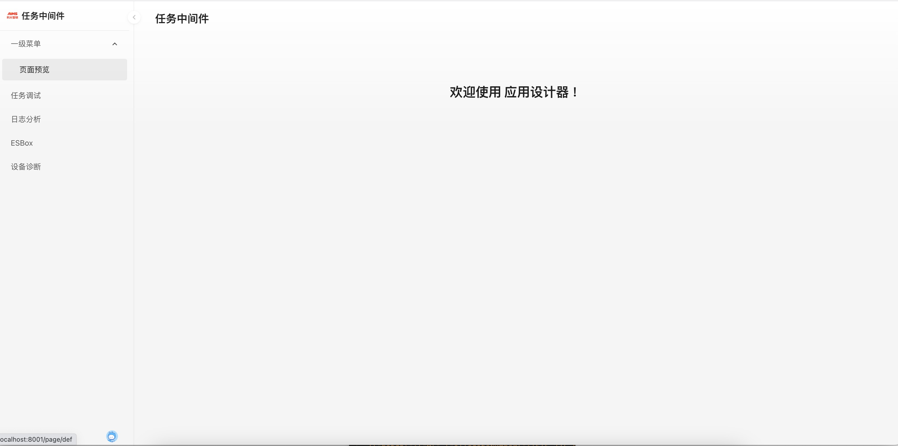
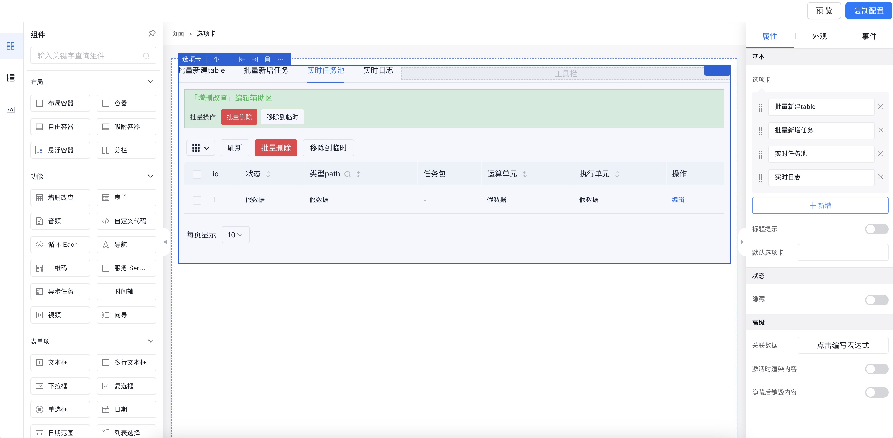

# 简介
## 运行
```
开发
npm i
npm run dev
发布
npm run build
```
## 项目概述
    设计思路：轻量化中后台应用的开发，对于常规中后台应用，可直接基于工具配置json、使用json模板、复制历史项目配置，实现快速开发、对变更友好。
- 应用运行首页

- 页面设计器

amis设计器使用帮助见[官网](https://baidu.github.io/amis/zh-CN/docs/index)
## 使用步骤
- 打开config/app.json，配置应用名称与菜单
```json
{
    "id": "task",//应用编号
    "title": "任务中间件",//应用名称
    "menus": [
        {
            "key": "1",
            "name": "一级菜单",
            "children": [//二级菜单
                {
                    //菜单指向页面名称默认为菜单的key.json
                    //页面路径/config/pages/xx.json
                    "key": "def",
                    "name": "页面预览"
                }
            ]
        },
        {
            "key": "task_debug",
            "name": "任务调试"
        },
        {
            "key": "task_log",
            "name": "日志分析"
        }
    ]
}
```
- 页面配置，运行应用点击菜单打开页面，在右上角点击编辑，在打开的百度amis页面设计器进行页面设计，设计完成后复制配置，保存为config/pages/xx.json（xx为对应菜单的key）；
## 自定义页面
- 可通过源码开发新路由，在菜单中path进行指定；
- 可通过amis的iframe引入；

## 技术栈
    react，集成了百度amis页面设计器，框架使用了`@umijs/max` 模板项目。

# 联系我
    e-mail：442969153@qq.como
    wechat：lkdm5201314